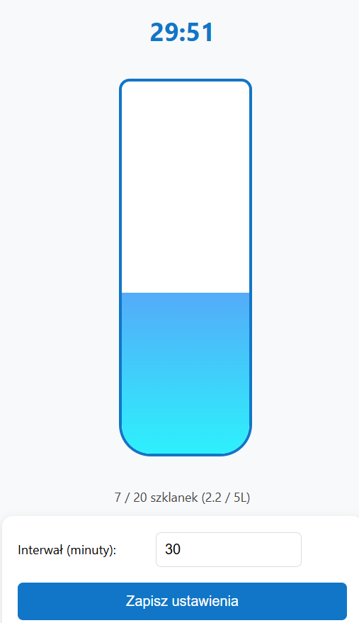
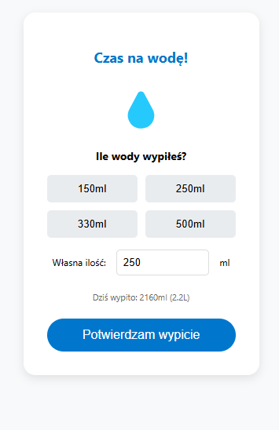

# Water Reminder Chrome Extension 🚰

A simple Chrome extension that helps you stay hydrated throughout the day by sending friendly reminders to drink water.

    
    

## Features

- Customizable reminder intervals (in minutes)
- Track your daily water intake
- Visual water bottle progress indicator
- Preset water amounts (150ml, 250ml, 330ml, 500ml) or custom input
- Pause/Resume reminder functionality
- Daily goal tracking (5L)

## How to Use

1. Install the extension
2. Click the extension icon to open settings
3. Set your preferred reminder interval (default is 30 mins)
4. When reminder pops up, select how much water you drank
5. Track your progress in the main popup window

You can pause reminders anytime by clicking "Pause Reminders" button in the main window.

## Installation

1. Clone this repo
2. Open Chrome and go to `chrome://extensions/`
3. Enable "Developer mode"
4. Click "Load unpacked" and select the extension folder

Made with 💧 for all the forgetful water drinkers out there.
